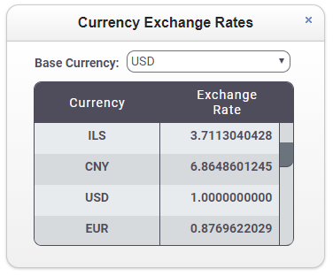

Consuming a Web Service Template
================================
This template is a simple demonstration of how to consume a Web Service using Node.js. It retrieves
currency exchange data and presents it in a sortable grid.

Async with No Callbacks
-----------------------
To simplify development, Profound.js Spaces provides pjs API to make asynchronous requests without having to
code callbacks. These API reduce complexity allowing you to code business application logic in a 
straightforward top-down manner.

pjs API
-------
- [pjs.sendRequest()](https://profoundjs.com/docs/profound.js-api/sendrequest) - Send a Web Services request from Node.js server-side code
- [display.grid.replaceRecords()](https://profoundjs.com/docs/profound.js-api/definedisplay#replacerecords-grid-method) - Clear and add records to a Rich Display Grid
- [pjs.defineDisplay()](https://profoundjs.com/docs/profound.js-api/definedisplay) - Create a Rich Display object from json definition
- [display.screen.execute()](https://profoundjs.com/docs/profound.js-api/definedisplay#execute-screen-method) - Display a screen and wait for user to respond
